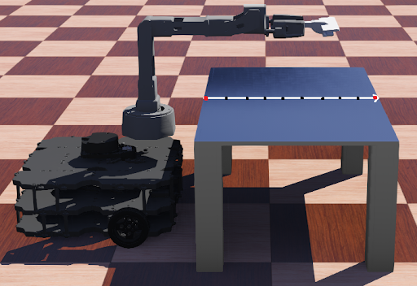

### The full Cloud 9 cleaning system includes many parts, including:

- An autonomous desk cleaning robot, named Clyde.
- A navigation stack for moving the robot between desks and mapping an area.
- A database that holds the locations of all tables, their sizes and colours.
- An arm that is attached to Clyde that cleans the desk.
- An accompanying app that facilitates desk booking.

These parts come together to make an autonomous sanitising system for desk tops and other flat surfaces in spaces such as libraries.

Below are more in-depth descriptions of each sub-system.

(include a uml sequence diagram here)

### The Mobile App:

When a user scans the QR code through our app, the app will connect to the database running in the background and update the status of the corresponding table.

If the user chooses to check in a table, the table will be marked “occupied” as an indication of being used.

If the user chooses to check out a table, the table will be marked “dirty” as an indication of needs cleaning.

### The Database:

The bookings database stores all the specific data on the desks, including location and status (i.e. occupied, clean, dirty). It's one of the core parts of our cleaning system. Both Clyde and users will access the database.

### Navigation:

The navigation sub-system employs Clyde’s 360° LIDAR unit to see his environment while his onboard Raspberry Pi computer to determines navigation routes - as seen in the photo to the right. (remove the photo if animation).

- Before Clyde is able to work on his own in a library or office, he uses a method called Simultaneous Localisation and Mapping (SLAM) to generate a detailed Occupancy Grid Map of its environment using LIDAR, which can then be used later for pathfinding. A qualified technician performs this mapping on set-up by driving Clyde around the environment manually. The animation … shows an example of the mapping in action.

- Clyde uses the Navigation2 ‘navigation stack’ - driven by the A* search algorithm - to move between desks, while LIDAR helps Clyde detect and avoid obstacles, both stationary and moving.

- All of the above is handled by a package of automatic python scripts, meaning Clyde can turn on and go all by himself. These scripts tell Clyde where to go by querying - using WiFi - Clyde’s accompanying database that holds the positions of all tables, this information is then published using a ROS2 action client.

### Vision

Clyde uses computer vision to perform two separate tasks. (preconditions before cleaning can be performed)

1. Scanning QR code on desk.  
  When Clyde reaches the desired desk, it first finds the QR code on the desk and retrieves the desk number from the QR code, then checks if the desk number matches the desired one.

2. Detecting obstruction on desk.  
  After the first checking is done, the robot will take a picture of the whole table and perform an obstruction detection algorithm using computer vision. This ensures the desk is empty before any cleaning is performed.

Once the cleaning is done, the robot will connect to the database and update the table’s status to “free”.

### The Arm

Once positioned at the desired desk, the arm performs the cleaning motion itself. The current version of the robot uses the PincherX 100 (?) robotic arm, which offers 5 degrees of freedom. The arm detects the surface of the desk, then carries out a series of movements to perform the sanitisation.

### The Cleaner

> The end of the arm is equipped with a custom...

### Methods:

> “Explain the key methods of how you got your system to work”

### System Diagrams:

> “You should include images (where available) which illustrate the methods you used, how the system works etc. This can include system diagrams, images of your system in certain states etc.”
